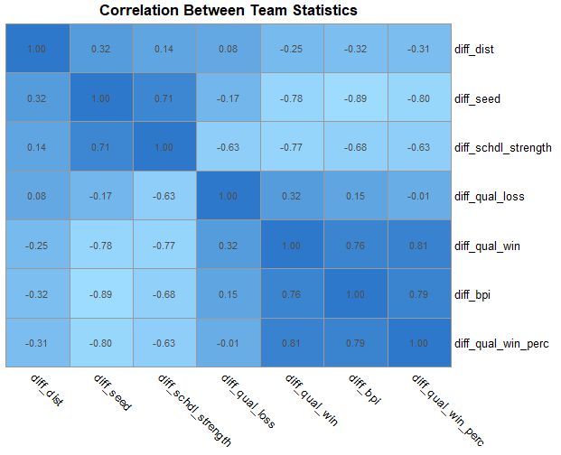
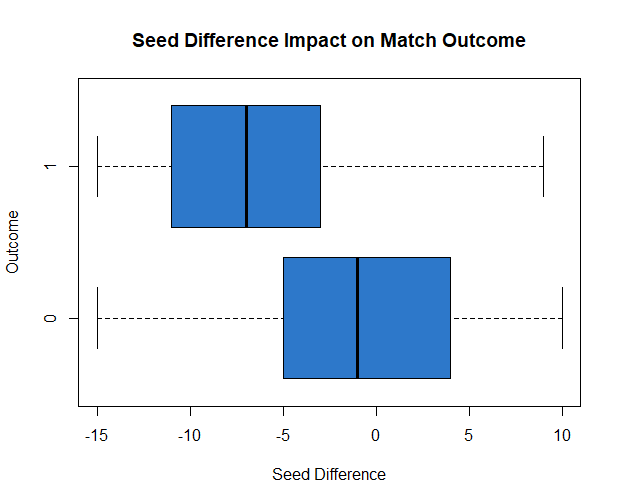
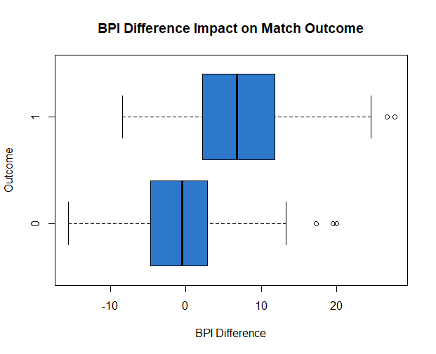
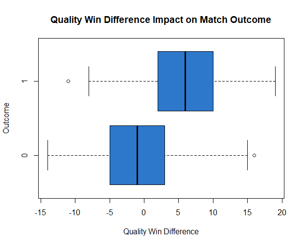
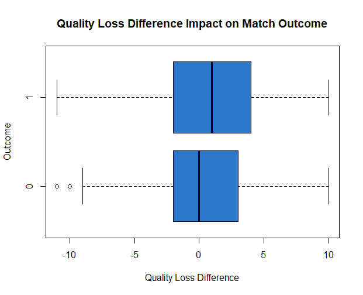
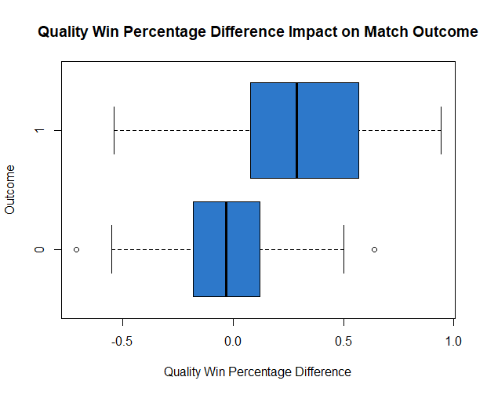
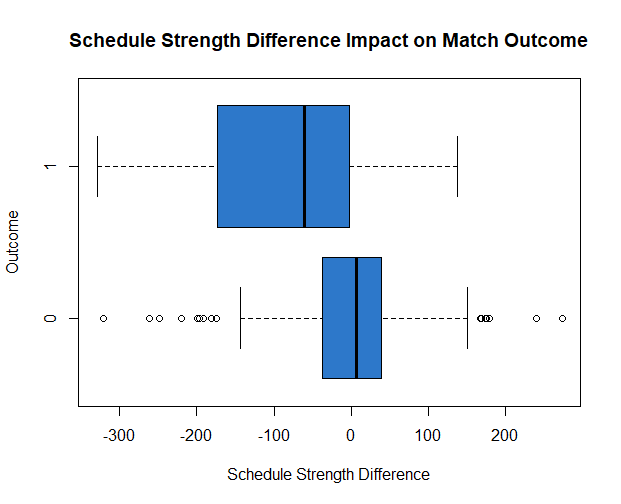
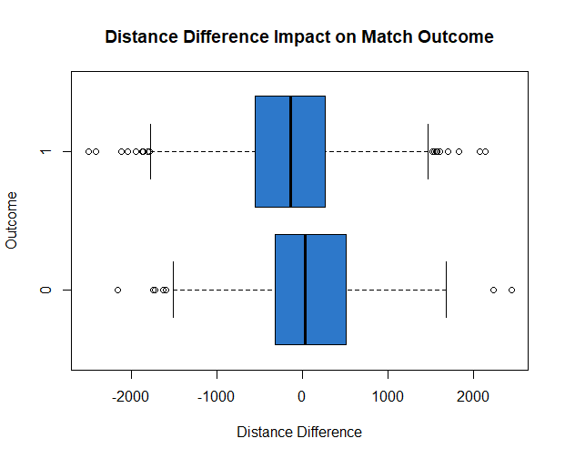

```{r setup, include=FALSE}
knitr::opts_chunk$set(echo = TRUE, comment = "")
# colors of the Theme: 9ddcff and 2d78ca
```

```{r packages, include=FALSE}
library(prettydoc)
library(df.formatter)
library(tidyverse)
library(neuralnet)
library(NeuralNetTools)
library(geosphere)
library(pheatmap)
```

# Overview

One of the greatest and most surprising sport competitions in the world is the NCAA Division I Men's Basketball Tournament, better known as March Madness. As the name suggests, all of the matches are not only extremely competitive but can result in some major upsets. The tournament consists of 68 teams, 64 of which participate in the 6 round tournament. 

Trying to successfully predict this bracket though is extremely difficult as each round depends on the previous one. Many people have tried, but no one has  officially achieved this feet. The probability of this happening is 1 in 9.2 Quintilian; however, certain 'guarantees' can result in better chances, for example with one seeds winning on almost every occasion except two.

So, this project is focused on attempting what no human has ever accomplished: picking a perfect bracket. But, as this is extremely difficult and practically impossible, machine learning will be used to predict a bracket for the 2025 March Madness tournament.

# Data Collection

For this project, the most crucial phase is accurate, detailed data collection because our predictions will be solely based on the metrics provided in the input data. To start, two main types of data sets were created, team data/bracket data and geographical data, where each have multiple versions that will be explained in depth here.

## Team Statistics

For the team statistics described here and also in the following bracket data subsection, data from each year was collected individually and sourced from [ESPN](https://www.espn.com/mens-college-basketball/bpi). Additionally, only the 64 teams playing in the main bracket, not the first four matches, will be included. The metrics collected for all teams in the years spanning from 2014 to 2024, where 2020 isn't included due to no tournament as a result of COVID-19, are seed, BPI, quality wins, quality loses, quality win percentage, and strength of schedule. 

The seed range is 1-16, four teams for each. BPI stands for Basketball Power Index which is a ESPN specific metric that represents the expected point margin per 70 possessions against an average opponent on a neutral court, perfect for the NCAA Tournament. All of the quality wins and losses are the outcomes against top 50 BPI teams. The win percentage is wins divided by total matches, in reference to those against top 50 BPI teams. The data from the 2024 season are shown.

```{r echo=FALSE}
train_data_24 <- read.csv("source_data/train_data_24.csv")
head(train_data_24)
rm(train_data_24)
```

Additionally, a data set that combines all of these team statistic data sets into one and then scales all of the numeric variables will be used later when scoring the machine learning model in an adaptive way, which will be covered later. While all of the years can be combined at this moment, the scaling will actively take place when working with the data in the scoring phase of the model, so a raw combination of all ten years is all that is in this data set currently.

```{r echo=FALSE}
all_team_stats <- read.csv("source_data/all_team_stats.csv")
head(all_team_stats)
```

## Bracket Data

Now, the team statistics above for each year were structured in a very specific format: they follow the order of appearance within the tournament bracket. This structure allows for the formatting of a data set that mimics all matches played within a given tournament. This function would take the first two teams and combined them in a row, merging their team statistics, adding the host location, contain a true/false value for if the first team won, and a final column of the name of the winner. Then, once the first round was completed, using the winner column, this formula performed the same task for the second round and so on until the championship match was completed. The output of this function for the 2024 is below, showing the first six matches and final six matches.

```{r echo=FALSE}
bracket_data_24 <- read.csv("final_data/bracket_data_24.csv")
head(bracket_data_24)
tail(bracket_data_24)
rm(bracket_data_24)
```

## Geographical Data

To complement the variables collected for the team statistics and bracket data, geographical data will also be collected, primarily longitude and latitude. The base data set used for reference is a `us_cities` data set that is built into my own package `df.formatter` that includes all us cities and pertinent information. That data was sourced from [simplemaps](https://simplemaps.com/data/us-cities) and will be referenced under the name `cities`. However, all that is needed from it is the location and its position.

```{r echo=FALSE}
cities <- us_cities

cities <- cities %>%
  select(city, state_id, lat, lng) %>%
  mutate(location = paste(city, state_id, sep = ", ")) %>%
  select(location, lat, lng)

head(cities)
```

Then, a list of all of the Division I schools in the United States and their locations was collected from [NCSA](https://www.ncsasports.org/mens-basketball/division-1-colleges). With this, the data set above could be merged with this new data set to create an optimized list of each school and their geographical location. The school names present in the bracket data and here were verified to be the same rendition to allow for a proper merge. Also, some school locations were manually altered as the listed cities are not present in the `cities` data set, not being recognized as an incorporated community with an official standing as a city.

This preparation will facilitate adding longitude and latitude to the final data set that will be used to train and test the machine learning model. The final school list, which includes an additional school, the University of Hartford, as it was previously Division I, competing in the 2021 March Madness, is shown here. The `cities` data set will also be used to find the location of the hosting cities for the tournament.

```{r echo=FALSE}
schools <- read.csv("geo_data/clean_school_list.csv")
head(schools)
rm(schools)
```

## Final Data Set

Now that all of the desired data as been collected and formatted to match the bracket style, all 10 years of data can be combined into one large data set. But, while metrics collected for the team statistics are good as well as the geographical data, when training the machine learning model, the presence of each metric twice, one for each team, is not ideal, so to fix this, the difference between metrics for team_x and team_y will be collected. An additional metric not present in the team statistics data set that will be in this final data set is the difference in distances for each team to the match location. This metric should cover factors such as travel time or being far from their normal environment. Below is the final data set that will be used in the machine learning model.

```{r echo=FALSE}
bracket_data <- read.csv("final_data/final_bracket_data.csv")
head(bracket_data)
tail(bracket_data)
```

So, in order to use this data set in the following analysis, the data types of the variables need to be verified. The only change is with the `team_x_win` variable that will now be an integer rather than a boolean to allow the machine learning model to work and provide specific probabilities of winning, allowing for further insight into confidence of the picks.

```{r echo=FALSE}
bracket_data$team_x_win <- as.integer(bracket_data$team_x_win)
str(bracket_data)
```

Additionally, at this point, two short vectors of the minimums and maximums of each of the numerical variables will be created to allow for the active scaling later on that was previously mentioned. Here are those two vectors respectively.

```{r echo=FALSE}
minimums <- sapply(bracket_data[,5:11], min)
maximums <- sapply(bracket_data[,5:11], max)
minimums
maximums
```

# Data Analysis

Before the machine learning model is trained though, some initial data analysis will be beneficial when deciding what variables to include in the model, ensuring predictability while also minimizing redundancy. The value that is trying to be predicted is a boolean of if the first team listed wins.

## Correlation Matrix

The first piece of analysis will be this correlation matrix to see how each of the independent numerical variables relate to each other and with how much strength.



Many of these variables are strongly related to other variables, a possible source of redundancy later on when making a machine learning model. But for the `diff_qual_loss` variable there appears to not be a lot of correlation with any other variables, besides `diff_schdl_strength`, a good variable to possibly incorporate in the model. The `diff_dist` also seems to reflect that same lack of correlation as the locations of the matches in the tournament shouldn't be related to the statistics of individual teams.

## Box Plots

Despite the benefit of using a correlation matrix to see the see relationships between numerical variables, visualizing all of these variables impacts on the outcome of the match is the most critical part of the initial analysis. In the following plots, each of the numerical variables will be separated by the outcome status for if the first team listed won (1 = True, 0 = False).



For example, in this first box plot, the presence of the median values varying by a significant amount represents how the more negative a seed difference is the more likely the outcome will be the first teams wins. That negative difference is a resulting of the better seeds playing worse seeds and winning. Also, this separation, with 75% of the top box plot being less than 50% of the other box plot, is promising for the machine learning model. This analysis will continue for the rest of the numeric variables.



This box plot also appears to have strong predictive capabilities as there is great separation between the median values of each box plot. So, the teams with a higher BPI are more likely to win. However, because `diff_seed` and `diff_bpi` have a strong linear relationship with each other, it could result in some redundancy within the machine learning model.



The same holds true for this box plot, where the more quality wins a team has the more likely they are to win their match. But, as a reminder, outliers are present in both box plots and are just another reason with it is so difficult to predict a bracket correctly.



This box plot is the first one so far to not have much variation between the two different outcomes, signifying a weaker ability at predicting the outcome of matches and should not be used in the machine learning model.



This box plot has similar characteristics to the first three and is most likely a strong predictor of match outcomes.



This box plot as well as a strong predictive capability. 



This box plot while not having the most separation between medians could possibly aid the machine learning model.

Overall, all of the numeric variables have good predictive capabilities except for `diff_qual_loss` and will possibly be used in the machine learning model, while keeping in mind possible redundancy by referencing the correlation matrix when incorporating many similar variables.

# Machine Learning Model

After having completed the initial exploratory data analysis, it is now time to move into making a machine learning model that will attempt to predict a March Madness bracket with high accuracy.

## Scaling Data

Before moving forward with the model though, all of the numerical variables have to be scaled as larger numerical variables would carry more weight if not scaled. This measure results in a far more accurate model and is commonplace. For this data, a minimum to maximum scaling method will be used, with zero as the minimum and one as the maximum; this is ideal for the neural network machine learning model that will be created.

```{r}
min_max_scale <- function(x) {
  return((x - min(x)) / (max(x) - min(x)))
}

bracket_data[,5:11] <- lapply(bracket_data[,5:11], min_max_scale)
```

## Splitting Data

While there are many ways to precisely split data into training and test data sets, because the main data set is made up of ten brackets, seven will be in the train data set and three will be in the test data set. The years chosen were selected to somewhat evenly spread out the years of the training and test data sets. This splitting method allows for an easier way to predict the results by making them match how an actual bracket would be scored. More details on measuring the performance of the model will be explained later.

```{r}
train_bracket <- bracket_data %>%
  filter(year != "2024" & year != "2021" & year != "2017")

test_bracket <- bracket_data %>%
  filter(year == "2024" | year == "2021" | year == "2017")
```

## Training Model

For this particular machine learning model, a neural network will be used from the `neuralnet` package. The model will predict the match outcome for team one, with a value between zero and one. To ensure that is the result, a logistic/sigmoid activation function will be used.

```{r fig.width=12}
set.seed(2025)
mdl1 <- neuralnet(team_x_win ~ diff_bpi + diff_qual_win + diff_qual_win_perc, data = train_bracket, hidden = c(2,2), act.fct = "logistic")
plotnet(mdl1)
```

## Rating Model

Now that a model has been made, the predictive capabilities of this model need to be assessed. However, there are multiple approaches to rating this model. The most obvious would be to score how many of the test data matches were predicted correctly. The issue with this though is that there are three different years in the test data set, and that when competing in bracket competitions, a progressive scoring system is used, where correct picks in later rounds are worth more.

So, creating a function that does this, is a good starting point, where each round has a max of 32 points, where the value of each match is 32 divided by the amount of matches in that entire round, for example round 1 (32 matches) has 1 point for each match and round 4 (2 matches) has 16 points for each match. This method will be used when scoring the predictions. Here is the first but basic scoring function.

```{r}
score_bracket <- function(model) {
  computation <- compute(model, test_bracket)
  probability <- computation$net.result
  predicted <- sapply(probability, function(x) {ifelse(x > .5, 1, 0)})
  results <- cbind(test_bracket$year, test_bracket$round, test_bracket$team_x_win, probability, predicted)
  results <- data.frame(year = results[,1], round = results[,2], actual = results [,3], probability = results[,4], predicted = results[,5])
  
  input_values <- c(64, 32, 16, 8, 4, 2)
  output_values <- c(1, 2, 4, 8, 16, 32)
  value_mapping <- setNames(output_values, input_values)
  
  points <- sapply(1:nrow(results), function(x) {
    if(results$actual[x] == results$predicted[x]) {
      return(value_mapping[as.character(results$round[x])])
    } else {
      return(0)
    }
  })
  
  results <- cbind(results, points)
  
  score <- results %>%
    group_by(year) %>%
    summarise(score = sum(points)) %>%
    arrange(desc(year))
  
  return(score)
}

score <- score_bracket(mdl1)
score
```

These results show promise, being around 150 for all three years, but the issue is that these values are overestimates of the models predictability because the test data pre-populates the matches in the subsequent rounds of the tournament, which is knowledge that is unknown when filling out brackets. So, while this model performed well, there is still room for lots of improvement with scores ranging from 170 to 180 usually winning the tournament challenge and also with the higher than expected outcome.

To fix this scoring method, the prediction has to adapt to what it previously predicts, altering all of the data within the test data set, including the teams stats for a given match. This new method relies on active data filling from an external data set which is the one from above that combined all ten years of team statistics into one data set, but once the data is mapped into the test data set, all of the values need to also be scaled according to the minimum to maximum scaling method used previously. The values from the minimum and maximum vectors create earlier will be used. Here is that more complex function that will be used.

```{r}
active_score_bracket <- function(model) {

  final_data <- list(year_2024 = data.frame(), year_2021 = data.frame(), year_2017 = data.frame())
  year <- c(2024, 2021, 2017)
  
  for(y in 1:3) {
    
    test_data <- test_bracket[test_bracket$year == year[y],]
    test_data <- test_data[1:32,]
    
    temp <- compute(model, test_data)
    probs <- temp$net.result
    temp <- sapply(probs, function(x) {ifelse(x > .5, 1, 0)})
    predictions <- test_data %>%
      mutate(probability = probs, team_x_win = temp, team = ifelse(team_x_win == 1, team_x, team_y))
    predictions <- predictions[,-1]
    
    bracket_data <- list(all_team_stats, round_64 = predictions, round_32 = data.frame(), round_16 = data.frame(), round_8 = data.frame(), round_4 = data.frame(), round_2 = data.frame())
    
    a <- c(32,16,8,4,2)
    b <- c(3,4,5,6,7)
  
    for(c in 1:5) {
      bracket_data[[b[c]]] <- data.frame(team_x = bracket_data[[b[c]-1]]$team[seq(from = 1, to = (a[c] - 1), by = 2)], team_y = bracket_data[[b[c]-1]]$team[seq(from = 2, to = a[c], by = 2)])
      bracket_data[[b[c]]] <- merge(x = bracket_data[[b[c]]], y = bracket_data[[1]][bracket_data[[1]]$year == year[y],], by.x = "team_x", by.y = "team", sort = FALSE)
      bracket_data[[b[c]]] <- merge(x = bracket_data[[b[c]]], y = bracket_data[[1]][bracket_data[[1]]$year == year[y],], by.x = "team_y", by.y = "team", sort = FALSE)
      bracket_data[[b[c]]] <- move.col(bracket_data[[b[c]]], 2, 1)
      bracket_data[[b[c]]] <- cbind(round = a[c], bracket_data[[b[c]]], probability = as.numeric(NA), team_x_win = as.logical(NA))
    
      # enter wrangling of data for differences and distances
      bracket_data[[b[c]]] <- bracket_data[[b[c]]][,-c(4,13)]
      bracket_data[[b[c]]] <- cbind(bracket_data[[b[c]]], location = test_bracket$location[test_bracket$year == year[y] & test_bracket$round == a[c]])
      
      bracket_data[[b[c]]] <- bracket_data[[b[c]]] %>%
        left_join(cities, by = "location")
    
      bracket_data[[b[c]]] <- bracket_data[[b[c]]] %>%
        rowwise() %>%
        mutate(dist_x = (distVincentySphere(c(lng.x, lat.x), c(lng, lat)))/1609.344, dist_y = (distVincentySphere(c(lng.y, lat.y), c(lng, lat)))/1609.344) %>%
        ungroup()
    
      bracket_data[[b[c]]] <- bracket_data[[b[c]]] %>%
        mutate(diff_seed = (seed.x - seed.y),
               diff_bpi = (bpi.x - bpi.y),
               diff_qual_win = (qual_win.x - qual_win.y),
               diff_qual_loss = (qual_loss.x - qual_loss.y),
               diff_qual_win_perc = (qual_win_perc.x - qual_win_perc.y),
               diff_schdl_strength = (schdl_strngth.x - schdl_strngth.y),
               diff_dist = (dist_x - dist_y))
    
      bracket_data[[b[c]]] <- bracket_data[[b[c]]] %>%
        select(round, team_x, team_y, diff_seed, diff_bpi, diff_qual_win, diff_qual_loss, diff_qual_win_perc, diff_schdl_strength, diff_dist, location, team_x_win)
    
      # scale differences
      for(t in 1:7) {
        bracket_data[[b[c]]][t+3] <- sapply(bracket_data[[b[c]]][t+3], function(x) {(x-minimums[t])/(maximums[t]-minimums[t])})
      }
    
      # enter model prediction
      temp <- compute(model, bracket_data[[b[c]]])
      probs <- temp$net.result
      temp <- sapply(probs, function(x) {ifelse(x > .5, 1, 0)})
      bracket_data[[b[c]]]$probability <- probs
      bracket_data[[b[c]]]$team_x_win <- temp
    
      bracket_data[[b[c]]] <- bracket_data[[b[c]]] %>%
        mutate(team = ifelse(team_x_win == 1, team_x, team_y))
    }
  
  final_data[[y]] <- rbind(data.frame(bracket_data[[2]]),
                           data.frame(bracket_data[[3]]),
                           data.frame(bracket_data[[4]]),
                           data.frame(bracket_data[[5]]),
                           data.frame(bracket_data[[6]]),
                           data.frame(bracket_data[[7]]))

  }
  
  # gets points for each bracket
  results <- rbind(final_data[[1]], final_data[[2]], final_data[[3]])
  colnames(results)[14] <- "probability"
  
  results <- data.frame(year = c(rep(2024, 63),rep(2021,63),rep(2017,63)), round = results[,1], actual = test_bracket[,14], probability = results[,14], predicted = results[,13])
  
  input_values <- c(64, 32, 16, 8, 4, 2)
  output_values <- c(1, 2, 4, 8, 16, 32)
  value_mapping <- setNames(output_values, input_values)
  
  points <- sapply(1:nrow(results), function(x) {
    if(results$actual[x] == results$predicted[x]) {
      return(value_mapping[as.character(results$round[x])])
    } else {
      return(0)
    }
  })
  
  results <- cbind(results, points)
  
  score <- results %>%
    group_by(year) %>%
    summarise(score = sum(points)) %>%
    arrange(desc(year))
  
  return(score)
}

final_score <- active_score_bracket(mdl1)
final_score
```

This model actually did a very good job at maintaining high performance despite starting from scratch when making its predictions. The scores are relatively similar to that from the less conservative scoring method used prior to this one. However, in the 2017, this model did under-perform and is something to keep in mind.

## Revising Model

Just because the first model appears to perform fairly well for the high level of unpredictability in March Madness does not mean that another model should not be made in hopes of improving the predictive capabilities. Based on that initial model, a few revisions will be made in hopes of improving its prediction power, specifically increasing the amount of layers processed within the model. Here is that revised model.

```{r fig.width=12}
set.seed(2025)
mdl2 <- neuralnet(team_x_win ~ diff_bpi + diff_qual_win + diff_qual_win_perc, data = train_bracket, hidden = c(2,3,2), act.fct = "logistic")
plotnet(mdl2)
```

## Rating Revised Model

Using the active scoring method to analyze the bracket, these are the resulting scores for this new model.

```{r echo=FALSE}
final_score2 <- active_score_bracket(mdl2)
final_score2
```

These score have a high level of consistency across years and also did not dramatically decrease in the year 2017 as did the previous model. This model did converge and hopefully will be a good predictor of the 2025 March Madness Tournament. The one concern would be possibly over-fitting the data due to the amount of layers, but this will be the model used for the final bracket test.

# Bracket Performance

Now that a machine learning model has been trained and revised to produce strong results, it will be put to the final test: the actual NCAA March Madness Men's Basketball Tournament. The process will follow that completed above with a few changes. The test data will be sourced from ESPN when the regular season is officially over. That data will be feed into the `active_score_bracket` function minus the final output score as the actual winners are unknown. Instead, what will be outputted is the predicted winners and also the probability of them winning which can be used as a value of confidence. Then, with those predictions, a March Madness bracket will be filled out on the ESPN Bracket Challenge to verify the results, which will be posted in the following sections.

## 2025 Bracket Data

The key data points that are needed for this model to work are the same ones collected earlier for the previous years: seed, BPI, quality wins, quality losses, quality win percentage, and strength of schedule. But in addition to those statistics, the coordinates of the school will be added already to facilitate the formatting when running the function to make bracket predictions. Here is that data set for the 2024-2025 season.

```{r echo=FALSE}
team_stats_25 <- read.csv("source_data/train_data_25.csv")
head(team_stats_25)
```

That data is then formatted into the bracket model to simulate all of the matches, While the structure here is valid with correct locations, the outcomes are just placeholders that will be ignored once in the prediction function. Here is that data set.

```{r echo=FALSE}
bracket_data_25 <- read.csv("final_data/bracket_data_25.csv")
head(bracket_data_25)
```

## Revised Prediction Function

With the second model from above, the March Madness bracket can be predicted. While it would be more effective to have a function with a parameter of not only just the model but the initial data set, here the function contains the data set already and is customized for this specific year. This can easily be adjusted though by changing the internal variable name being referenced or extract the initial step.

```{r}
predict_bracket <- function(model) {
  
  test_data <- bracket_data_25
  test_data <- test_data[1:32,]
  
  temp <- compute(model, test_data)
  probs <- temp$net.result
  temp <- sapply(probs, function(x) {ifelse(x > .5, 1, 0)})
  probs <- sapply(probs, function(x) {ifelse(x < .5, (1-x), x)})
  predictions <- test_data %>%
    mutate(probability = probs, team_x_win = temp, team = ifelse(team_x_win == 1, team_x, team_y))
  predictions <- predictions[,-1]
  
  bracket_data <- list(team_stats_25, round_64 = predictions, round_32 = data.frame(), round_16 = data.frame(), round_8 = data.frame(), round_4 = data.frame(), round_2 = data.frame())
  
  a <- c(32,16,8,4,2)
  b <- c(3,4,5,6,7)
  
  for(c in 1:5) {
    bracket_data[[b[c]]] <- data.frame(team_x = bracket_data[[b[c]-1]]$team[seq(from = 1, to = (a[c] - 1), by = 2)], team_y = bracket_data[[b[c]-1]]$team[seq(from = 2, to = a[c], by = 2)])
    bracket_data[[b[c]]] <- merge(x = bracket_data[[b[c]]], y = bracket_data[[1]], by.x = "team_x", by.y = "team", sort = FALSE)
    bracket_data[[b[c]]] <- merge(x = bracket_data[[b[c]]], y = bracket_data[[1]], by.x = "team_y", by.y = "team", sort = FALSE)
    bracket_data[[b[c]]] <- move.col(bracket_data[[b[c]]], 2, 1)
    bracket_data[[b[c]]] <- cbind(round = a[c], bracket_data[[b[c]]], probability = as.numeric(NA), team_x_win = as.logical(NA))
    
    # enter wrangling of data for differences and distances
    bracket_data[[b[c]]] <- cbind(bracket_data[[b[c]]], location = bracket_data_25$location[bracket_data_25$round == a[c]])
    bracket_data[[b[c]]] <- bracket_data[[b[c]]] %>%
      left_join(cities, by = "location")
    
    bracket_data[[b[c]]] <- bracket_data[[b[c]]] %>%
      rowwise() %>%
      mutate(dist_x = (distVincentySphere(c(lng.x, lat.x), c(lng, lat)))/1609.344, dist_y = (distVincentySphere(c(lng.y, lat.y), c(lng, lat)))/1609.344) %>%
      ungroup()
    
    bracket_data[[b[c]]] <- bracket_data[[b[c]]] %>%
      mutate(diff_seed = (seed.x - seed.y),
             diff_bpi = (bpi.x - bpi.y),
             diff_qual_win = (qual_win.x - qual_win.y),
             diff_qual_loss = (qual_loss.x - qual_loss.y),
             diff_qual_win_perc = (qual_win_perc.x - qual_win_perc.y),
             diff_schdl_strength = (schdl_strngth.x - schdl_strngth.y),
             diff_dist = (dist_x - dist_y))
    
    bracket_data[[b[c]]] <- bracket_data[[b[c]]] %>%
      select(round, team_x, team_y, diff_seed, diff_bpi, diff_qual_win, diff_qual_loss, diff_qual_win_perc, diff_schdl_strength, diff_dist, location, team_x_win)
    
    # scale differences
    for(t in 1:7) {
      bracket_data[[b[c]]][t+3] <- sapply(bracket_data[[b[c]]][t+3], function(x) {(x-minimums[t])/(maximums[t]-minimums[t])})
    }
    
    # enter model prediction
    temp <- compute(model, bracket_data[[b[c]]])
    probs <- temp$net.result
    temp <- sapply(probs, function(x) {ifelse(x > .5, 1, 0)})
    probs <- sapply(probs, function(x) {ifelse(x < .5, (1-x), x)})
    bracket_data[[b[c]]]$probability <- probs
    bracket_data[[b[c]]]$team_x_win <- temp
    
    bracket_data[[b[c]]] <- bracket_data[[b[c]]] %>%
      mutate(team = ifelse(team_x_win == 1, team_x, team_y))
  }
  
  results <- rbind(data.frame(bracket_data[[2]]),
                   data.frame(bracket_data[[3]]),
                   data.frame(bracket_data[[4]]),
                   data.frame(bracket_data[[5]]),
                   data.frame(bracket_data[[6]]),
                   data.frame(bracket_data[[7]]))
  
  colnames(results)[14] <- "probability"
  
  results <- data.frame(round = results[,1], probability = results[,13], predicted = results[,14])
  
  return(results)
}

bracket_prediction <- predict_bracket(mdl2)
```

Here is the output from the model that contains the probability of a team winning their match and the overall decision, based on the team most favored by the probability.

```{r echo=FALSE}
head(bracket_prediction)
tail(bracket_prediction)
```

## Submitted Bracket

Using the outcomes from the bracket prediction simulation, a bracket on ESPN's bracket challenge was filled out in totality and submitted to ensure authenticity. An image of the completed bracket is located in the prediction_model folder. Most of the predictions are in line with the overall seedings, but there are some upsets present across the early rounds. The model predicted Auburn to win the whole tournament.

## Bracket Results

Following the conclusion of the tournament, the bracket earned 1210 points out of 1920, with many of those points, 320, being lost due to not picking the national champion. Overall, the model predicted 73% of matches correct, placing almost within the top 80th percentile on ESPN. The bracket, however, did perform better than chalk, my personal brackets, and other smart brackets completed with analytical tools provided by ESPN. The model's performance definitely exceeded expectations for this initial neural network model project.

# Conclusion

Through this data science project, the importance of collecting and using non-biased data and also how to fine-tune neural network models to provide more accurate results was learned. While this project mainly used ranked data, this data has inherent bias to favor the initial tournament seedings and also the preferences of the college basketball ranking committee. Next year, by using more performance statistics that represent the on-court athleticism, skill, and precision, a more accurate prediction of the tournament outcomes can be made. 

One of the best parts about this entire project was the ability to have tangible results in order to check the model's performance. Additionally, next time different machine learning approaches will be incorporated to be able to cross-compare their results. In the end, this project provided a fun and rewarding way to practice the data science pipeline and begin experiencing the world of machine learning.
